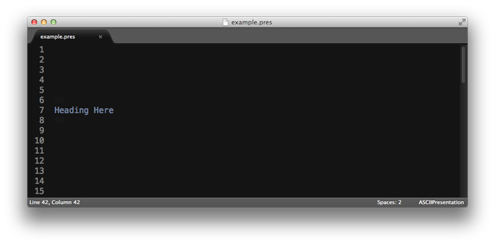
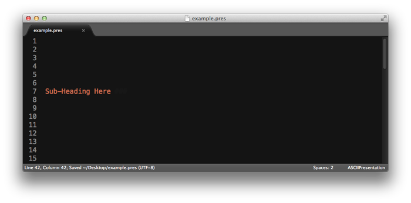
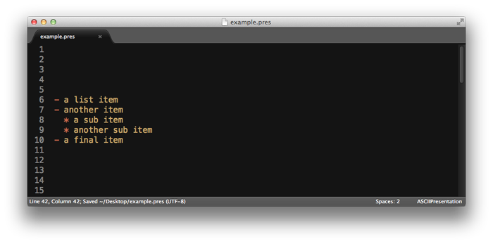
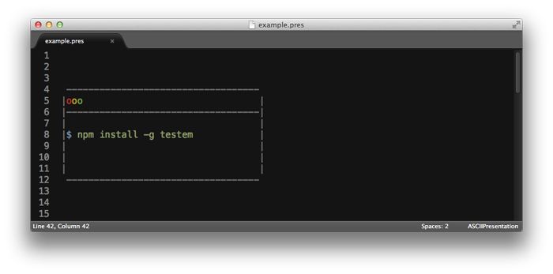
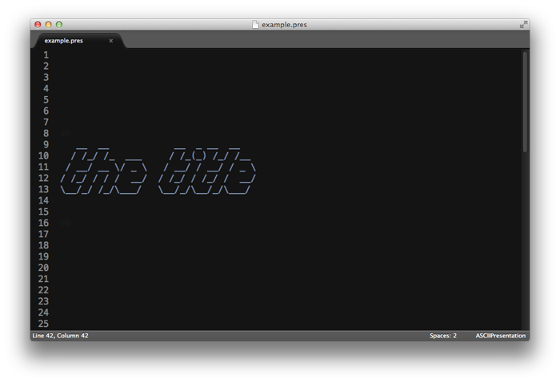
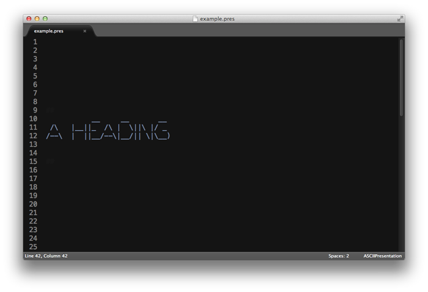
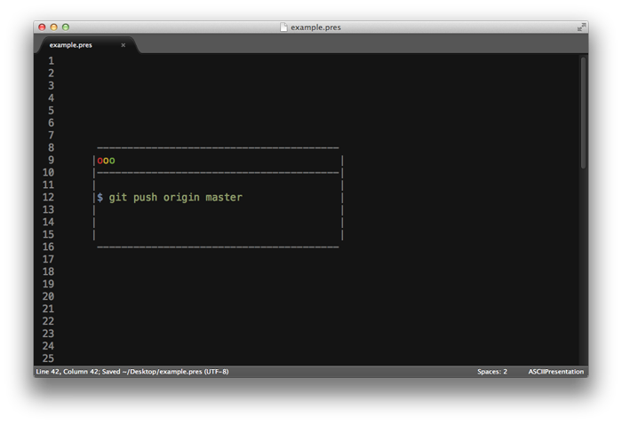

# ASCII Presentation

Why use Sublime just to create presentations when you can also use it as the presentation tool?

Check out [my presentation on browserify](https://github.com/chrisbreiding/presentations/blob/master/browserify/presentation.pres) as an example.

This package helps you create presentations in a couple ways:

* a syntax utilized to color highlight your presentation
* a few keyboard shortcuts/commands to help create ASCII art and space out "slides"

## Syntax

The following syntax is available and will be color highlighted based on your color scheme and the extra colors listed under [Installation](#installation) below. By default, the syntax highlighting works with files with the extension `pres`. The examples in the screenshots use a customized version of the Twilight color scheme.

### Headings

```
##
Heading Here
##
```



### Sub-headings

```
Sub-Heading Here ###
```



### Lists
```
- a list item
- another item
  * a sub item
  * another sub item
- a final item
```



### ASCII terminal

```
 -----------------------------------
|ooo                                |
|-----------------------------------|
|                                   |
|$ npm install -g testem            |
|                                   |
|                                   |
|                                   |
 -----------------------------------
```



For the ASCII headings in the [browserify presentation](https://github.com/chrisbreiding/presentations/blob/master/browserify/presentation.pres), I used [http://patorjk.com/software/taag/](http://patorjk.com/software/taag/).

In the future, I hope to add some functionality to the package so that it can automatically create ASCII headings for you with just a keyboard shortcut.

## Keyboard Shortcuts / Commands

The following are available as keyboard shortcuts and commands in the Command Palette as well as under the Edit menu.

### Convert Title to ASCII

Convert the selected text or the word your cursor is on into ASCII art.

The font is configurable in your settings. See [available fonts here](http://www.figlet.org/fontdb.cgi).

_Default shortcut_: <kbd>super</kbd> + <kbd>ctrl</kbd> + <kbd>c</kbd>, <kbd>super</kbd> + <kbd>ctrl</kbd> + <kbd>t</kbd>



### Convert Heading to ASCII

Convert the selected text or the word your cursor is on into ASCII art.

The font is configurable in your settings. See [available fonts here](http://www.figlet.org/fontdb.cgi).

_Default shortcut_: <kbd>super</kbd> + <kbd>ctrl</kbd> + <kbd>c</kbd>, <kbd>super</kbd> + <kbd>ctrl</kbd> + <kbd>h</kbd>



### Add Terminal ASCII

Add ASCII art that looks like a Terminal/Command Prompt.

The width and height of the Terminal are configurable in your settings.

_Default shortcut_: <kbd>super</kbd> + <kbd>ctrl</kbd> + <kbd>a</kbd>, <kbd>super</kbd> + <kbd>ctrl</kbd> + <kbd>t</kbd>



### New Slide

Add a set amount of lines to space out two "slides." The default is 20 lines.

The number of lines is configurable in your settings.

_Default shortcut_: <kbd>super</kbd> + <kbd>ctrl</kbd> + <kbd>n</kbd>, <kbd>super</kbd> + <kbd>ctrl</kbd> + <kbd>s</kbd>

## Installation

1 - Clone this repo into your Sublime Text Packages directory.

2 - Add the following to your color scheme:

  ```
    <dict>
      <key>name</key>
      <string>ascii_presentation.invisible</string>
      <key>scope</key>
      <string>ascii_presentation.invisible</string>
      <key>settings</key>
      <dict>
        <key>foreground</key>
        <string>#141414</string>
      </dict>
    </dict>
    <dict>
      <key>name</key>
      <string>ascii_presentation.close</string>
      <key>scope</key>
      <string>ascii_presentation.close</string>
      <key>settings</key>
      <dict>
        <key>foreground</key>
        <string>#BE2E2E</string>
      </dict>
    </dict>
    <dict>
      <key>name</key>
      <string>ascii_presentation.minimize</string>
      <key>scope</key>
      <string>ascii_presentation.minimize</string>
      <key>settings</key>
      <dict>
        <key>foreground</key>
        <string>#BFA22E</string>
      </dict>
    </dict>
    <dict>
      <key>name</key>
      <string>ascii_presentation.expand</string>
      <key>scope</key>
      <string>ascii_presentation.expand</string>
      <key>settings</key>
      <dict>
        <key>foreground</key>
        <string>#70A340</string>
      </dict>
    </dict>
    <dict>
      <key>name</key>
      <string>ascii_presentation.chrome</string>
      <key>scope</key>
      <string>ascii_presentation.chrome</string>
      <key>settings</key>
      <dict>
        <key>foreground</key>
        <string>#777</string>
      </dict>
    </dict>
  ```
3 - Update the ascii_presentation.invisible color to match the background of your color scheme. Tweak other colors as desired.

## Modification

If you'd like to hack on the syntax definition, edit the `ASCIIPresentation.JSON-tmLanguage` file. Check out the [syntax definition docs](http://docs.sublimetext.info/en/latest/extensibility/syntaxdefs.html) for more info.

Pull requests are welcome!

## Credits

The package would not be possible without:

* [pyfiglet](https://github.com/pwaller/pyfiglet), the Python port of [FIGlet](http://www.figlet.org/), which provides the ASCII art font conversion
* encouragement from the folks at the [Atlanta JavaScript Meetup](http://atlantajavascript.com)

## License

Copyright (c) 2013 Chris Breiding

This program is free software; you can redistribute it and/or
modify it under the terms of the GNU General Public License
as published by the Free Software Foundation; either version 2
of the License, or (at your option) any later version.

This program is distributed in the hope that it will be useful,
but WITHOUT ANY WARRANTY; without even the implied warranty of
MERCHANTABILITY or FITNESS FOR A PARTICULAR PURPOSE.  See the
GNU General Public License for more details.

See [LICENSE](LICENSE) for full details.
